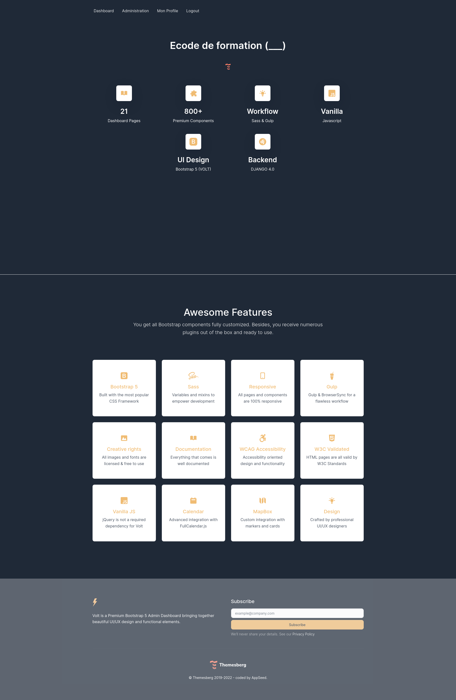
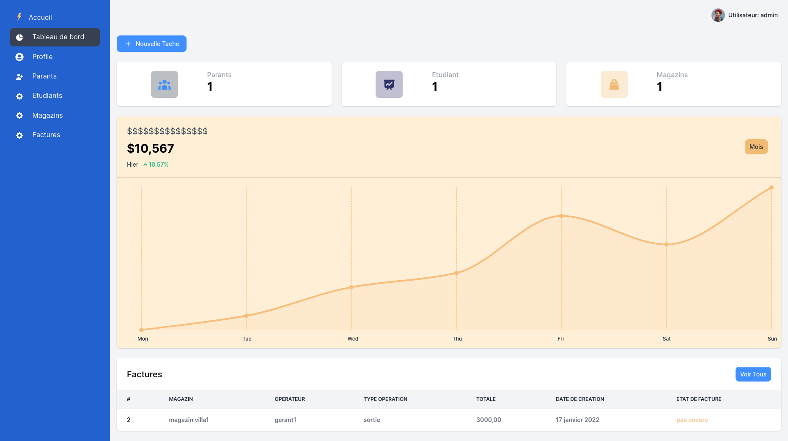
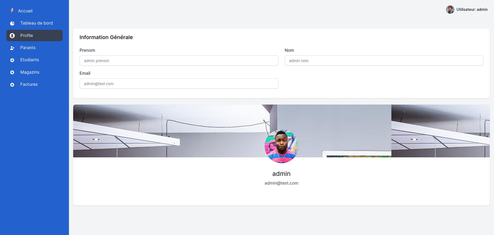

# private training school (ecole de formation)


[](https://opensource.org/licenses/MIT)

## Description:# Django Bootstrap 5 Volt Training School
This project is a web plateforme for School_managment made with Django Framework, it contains a CRUD managment for the school details and all its rubrics like the Parants, the students and all other staff and teachers.
It contains an Invoice and Stock managments and a dashboard visualisation page.


## Screenshots:
### A HOME PAGE Bootstrap 5 UI:


### Login UI:


### Dashboard UI:


### Dashboard Profile UI:



## TODO:
- [ ] Switch from sqlite to poistgresql.
- [ ] Minimize the Media Files size.
- [ ] ADD a CRM to controle the Test and Exams results.


## Tools & languages:    
* Visual Studio Code (IDE).
* Python (Logic code).
* Django template language (DTL) (UI Library).
* HTML & CSS & BOOTSTRAP5 (UI Design).

## ✨ How to use it

```bash
$ # Get the code
$ git clone 
$ cd django-volt-dashboard
$
$ # Virtualenv modules installation (Unix based systems)
$ virtualenv env
$ source env/bin/activate
$
$ # Virtualenv modules installation (Windows based systems)
$ # virtualenv env
$ # .\env\Scripts\activate
$
$ # Install modules - SQLite Storage
$ pip3 install -r requirements.txt
$
$ # Create tables
$ python manage.py makemigrations
$ python manage.py migrate
$
$ # Start the application (development mode)
$ python manage.py runserver # default port 8000
$
$ # Start the app - custom port
$ # python manage.py runserver 0.0.0.0:<your_port>
$
$ # Access the web app in browser: http://127.0.0.1:8000/
```

> Note: To use the app, please create a super user . After authentication, the app will unlock the private pages.

<br />


<br />

**Step #1** - Install tools

- [NodeJS](https://nodejs.org/en/) 12.x or higher
- [Gulp](https://gulpjs.com/) - globally 
    - `npm install -g gulp-cli`
- [Yarn](https://yarnpkg.com/) (optional) 

<br />

**Step #2** - Change the working directory to `assets` folder

```bash
$ cd apps/static/assets
```

<br />

**Step #3** - Install modules (this will create a classic `node_modules` directory)

```bash
$ npm install
// OR
$ yarn
```

<br />

**Step #4** - Edit & Recompile SCSS files 

```bash
$ gulp scss
```

The generated file is saved in `static/assets/css` directory.

<br />

## ✨ Deployment

The app is provided with a basic configuration to be executed in [Docker](https://www.docker.com/), [Gunicorn](https://gunicorn.org/), and [Waitress](https://docs.pylonsproject.org/projects/waitress/en/stable/).

### [Gunicorn](https://gunicorn.org/)
---

Gunicorn 'Green Unicorn' is a Python WSGI HTTP Server for UNIX.

> Install using pip

```bash
$ pip install gunicorn
```
> Start the app using gunicorn binary

```bash
$ gunicorn --bind=0.0.0.0:8001 core.wsgi:application
Serving on http://localhost:8001
```

Visit `http://localhost:8001` in your browser. The app should be up & running.


<br />

### [Waitress](https://docs.pylonsproject.org/projects/waitress/en/stable/)
---

Waitress (Gunicorn equivalent for Windows) is meant to be a production-quality pure-Python WSGI server with very acceptable performance. It has no dependencies except ones that live in the Python standard library.

> Install using pip

```bash
$ pip install waitress
```
> Start the app using [waitress-serve](https://docs.pylonsproject.org/projects/waitress/en/stable/runner.html)

```bash
$ waitress-serve --port=8001 core.wsgi:application
Serving on http://localhost:8001
```

Visit `http://localhost:8001` in your browser. The app should be up & running.

<br />

## ✨ Credits & Links

- [Django](https://www.djangoproject.com/) - The official website
- [Boilerplate Code](https://appseed.us/boilerplate-code) - Index provided by **AppSeed**
- [Boilerplate Code](https://github.com/app-generator/boilerplate-code) - Index published on Github

<br />

---
[Django Bootstrap 5](https://appseed.us/admin-dashboards/django-dashboard-volt) Volt - Provided by **AppSeed [App Generator](https://appseed.us/app-generator)**.
